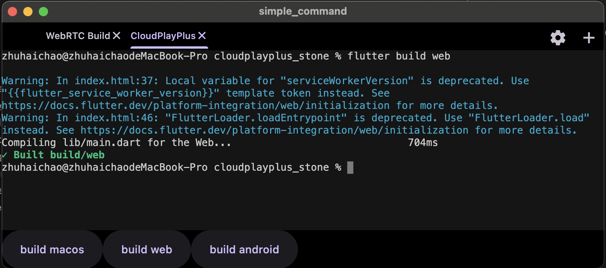
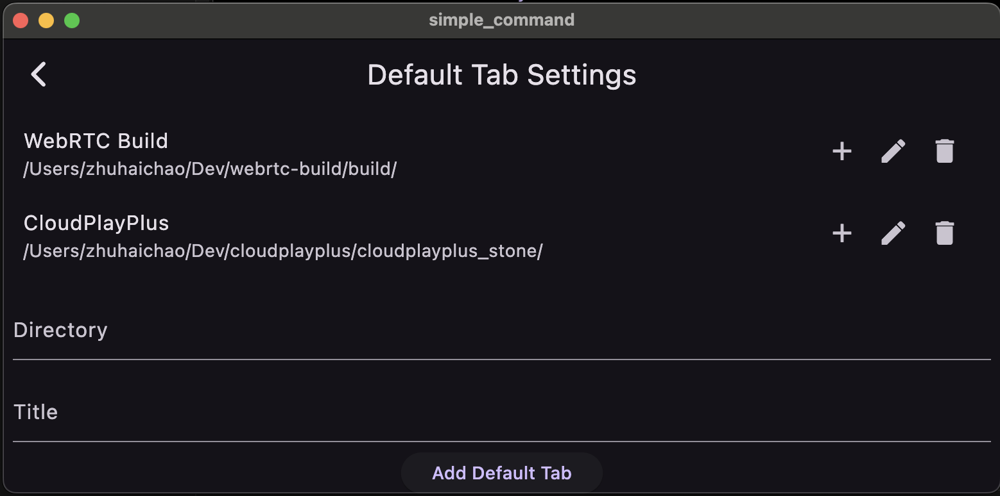
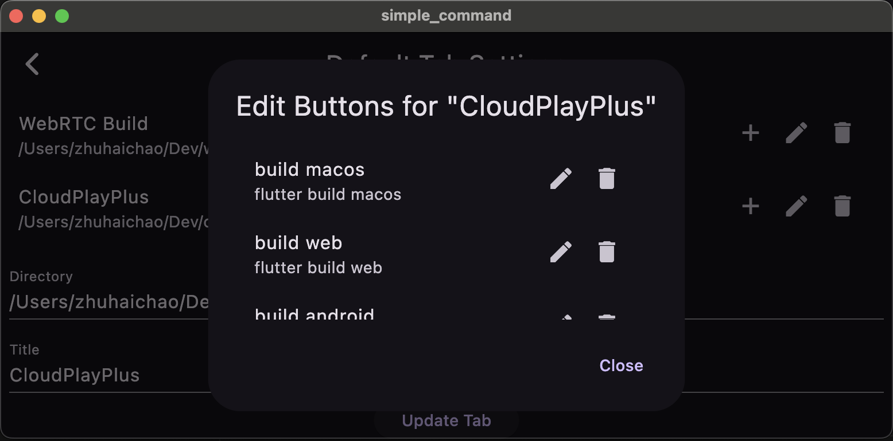

# simple_command

A simple command line tool for developers who suffers from looking for the command line tool he want and remember the commands.
You can manage the terminals tabs you open by default and manage the buttons and related commands.

Screenshots:

